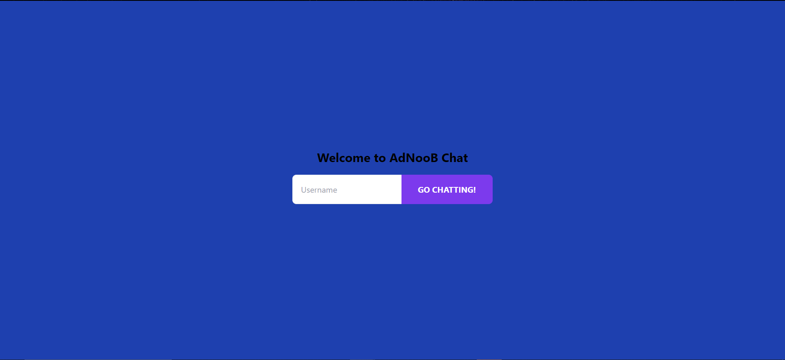
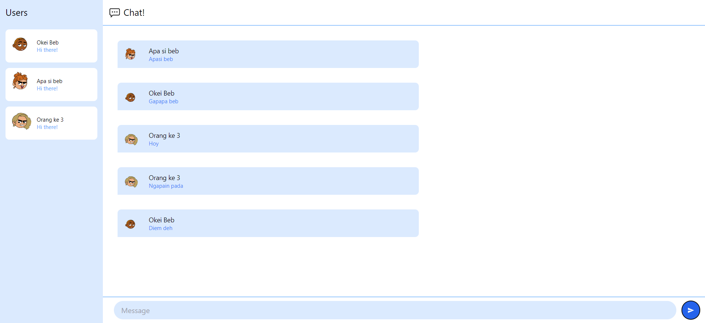

#### Nama : Muh. Kemal Lathif Galih Putra
#### NPM : 2206081225
#### Kelas : ADPRO - A
#### ASDOS : REN

# TUTORIAL - 10
## Refleksi

__3.1. Original code__

Pada tutorial ini saya melakukan clone dari github SimpleWebSocket sebaga integrasi websocket dan YewChat sebagai frontend dari chat nya. Lalu tertampilah kata kata dari client client yang ada.

__3.2 . Add some creativities to the webclient__

Saya mengganti warna dan memberikan judul pada landing page-login di website yew

Lalu saya mengganti warna dalam chatnya juga dengan base biru muda dan memberikan avatar random yang otomatis dibuat base on client yang masuk.